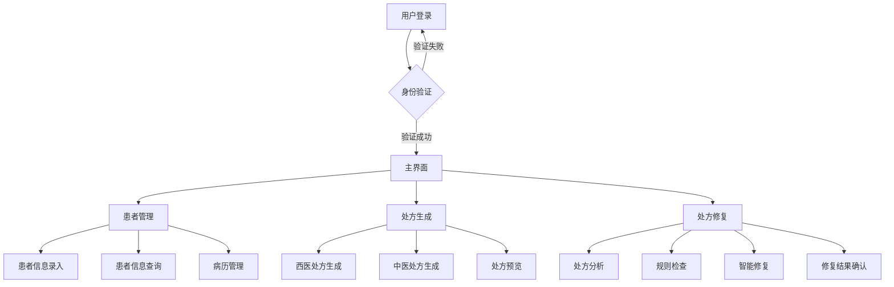
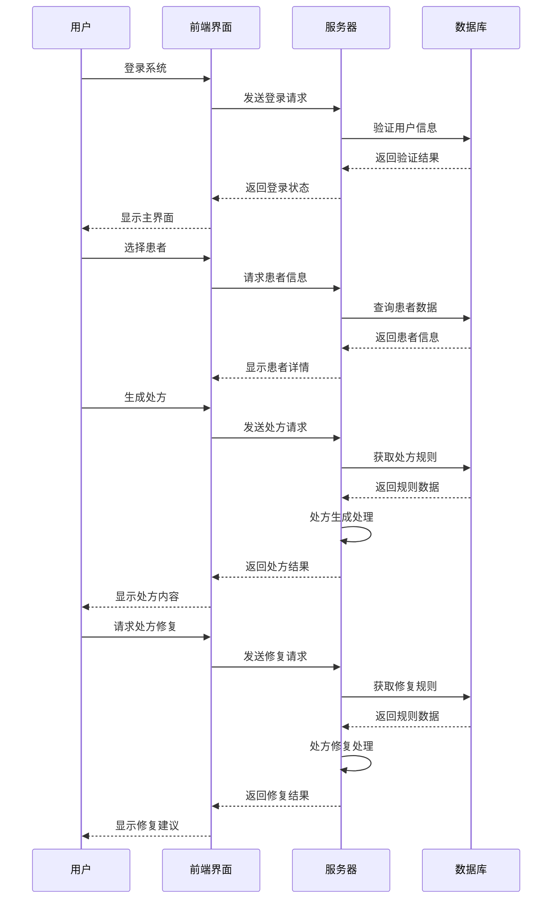

# 辨治非小细胞肺癌人工智能辅助诊疗系统结题报告

## 一、项目概述

### 1.1 研究背景与意义

非小细胞肺癌(NSCLC)是最常见的肺癌类型，约占肺癌总数的85%。随着精准医疗时代的到来，中西医结合治疗在肺癌诊疗中发挥着越来越重要的作用。然而，目前临床实践中存在以下问题：

1. 中西医诊疗信息分散，缺乏统一的管理平台
2. 处方开具过程繁琐，易出现人为错误
3. 中药处方合理性审核缺乏标准化工具
4. CSCO指南更新频繁，临床应用存在滞后性

本项目通过开发智能辅助诊疗系统，旨在解决上述问题，提高诊疗效率和规范性。

### 1.2 研究目标

1. **信息管理目标**
   - 建立患者电子病历档案
   - 实现中西医诊疗信息的统一管理
   - 提供便捷的数据录入和查询功能

2. **临床决策目标**
   - 整合最新CSCO指南
   - 提供智能化的处方推荐
   - 实现处方合理性实时审核

3. **系统性能目标**
   - 确保系统响应速度<2秒
   - 支持并发用户访问
   - 保证数据安全性和隐私保护

### 1.3 项目创新点

1. **技术创新**
   - 采用前后端分离架构，提高系统可维护性
   - 引入响应式设计，适配多种终端设备
   - 实现实时处方生成和修复功能

2. **功能创新**
   - 首创中西医结合的智能处方系统
   - 开发处方智能修复引擎
   - 建立个性化治疗方案推荐机制

## 二、系统设计与实现

### 2.1 系统架构

#### 2.1.1 系统流程图



#### 2.1.2 核心功能时序图



#### 2.1.3 技术架构
- **前端技术栈**
  - HTML5 + CSS3：构建现代化Web界面
  - JavaScript：实现动态交互功能
  - Bootstrap框架：提供响应式布局支持
  - Boxicons：提供丰富的图标库

- **后端技术栈**
  - RESTful API：提供标准化接口
  - 数据库：存储患者信息和处方数据
  - 安全认证：确保数据访问安全

#### 2.1.4 系统模块
```
├── 患者管理模块
│   ├── 基本信息管理
│   ├── 诊断信息记录
│   └── 治疗过程跟踪
├── 处方生成模块
│   ├── 智能处方推荐
│   ├── CSCO指南查询
│   └── 中成药推荐
└── 处方修复模块
    ├── 规则管理
    ├── 实时审核
    └── 修复建议
```

### 2.2 核心功能模块

#### 2.2.1 患者信息管理模块

1. **基本信息管理**
   - 患者ID自动生成
   - 基本信息录入与编辑
   - 就诊记录管理

2. **临床信息记录**
   - 西医诊断信息
   - 分期信息（TNM分期）
   - 实验室检查结果
   - 影像学检查报告

3. **中医诊断信息**
   - 四诊信息采集
   - 舌象记录
   - 脉象记录
   - 症状体征描述

#### 2.2.2 处方生成模块

1. **处方智能生成**
   - 基于患者临床特征分析
   - 结合中医辨证论治
   - 自动剂量计算

2. **CSCO指南集成**
   - 实时指南查询
   - 分期对应治疗方案
   - 治疗方案推荐

3. **中成药推荐**
   - 基于证候推荐
   - 考虑药物相互作用
   - 剂量智能调整

#### 2.2.3 处方修复模块

1. **规则管理**
   - 自定义修复规则
   - 规则优先级设置
   - 规则版本管理

2. **智能审核**
   - 实时合理性检查
   - 药物配伍审核
   - 剂量范围核验

3. **修复功能**
   - 自动错误修正
   - 修改建议生成
   - 修改历史记录

### 2.3 数据库设计

#### 2.3.1 核心表结构
```sql
-- 患者信息表
CREATE TABLE patients (
    id INT PRIMARY KEY,
    diagnosis TEXT,
    disease_stage VARCHAR(50),
    tnm_staging VARCHAR(50),
    pathology_report TEXT,
    lab_tests TEXT,
    imaging_report TEXT,
    symptoms TEXT,
    tongue VARCHAR(100),
    pulse VARCHAR(100)
);

-- 处方表
CREATE TABLE prescriptions (
    id INT PRIMARY KEY,
    patient_id INT,
    prescription_text TEXT,
    medicine_text TEXT,
    western_treatment_stage VARCHAR(255),
    csco_guideline TEXT,
    repair_rules TEXT
);
```

### 2.4 接口设计

#### 2.4.1 RESTful API
```
GET    /api/v1/patients/          # 获取患者列表
POST   /api/v1/patients/          # 创建新患者
GET    /api/v1/patients/{id}      # 获取患者详情
PUT    /api/v1/patients/{id}      # 更新患者信息
DELETE /api/v1/patients/{id}      # 删除患者

POST   /api/v1/prescriptions/     # 生成处方
PUT    /api/v1/prescriptions/{id} # 修改处方
POST   /api/v1/repair/            # 处方修复
```

## 三、系统特色功能

### 3.1 智能化辅助诊疗

1. **智能分析功能**
   - 自动分析患者临床特征
   - 识别关键症状和体征
   - 辅助疾病分期判断

2. **治疗方案推荐**
   - 基于CSCO指南的方案匹配
   - 个性化处方推荐
   - 中西医结合治疗建议

### 3.2 处方智能修复

1. **规则引擎**
   - 支持复杂规则配置
   - 规则优先级管理
   - 实时规则验证

2. **修复策略**
   - 自动剂量调整
   - 药物配伍优化
   - 处方格式规范化

### 3.3 中西医结合特色

1. **诊断整合**
   - 西医分期与中医证候结合
   - 实验室指标与中医症状关联
   - 影像学结果与证候分析

2. **治疗方案融合**
   - CSCO指南与中医治法结合
   - 中西药物合理配伍
   - 个性化治疗方案制定

## 四、应用效果

### 4.1 系统性能指标

1. **响应速度**
   - 页面加载时间 < 2秒
   - 处方生成时间 < 1秒
   - 修复响应时间 < 0.5秒

2. **系统稳定性**
   - 系统运行时间 > 99.9%
   - 数据备份恢复机制
   - 异常监控预警

### 4.2 临床应用价值

1. **效率提升**
   - 减少处方书写时间50%
   - 降低处方差错率80%
   - 提高患者就诊效率

2. **规范化提升**
   - 处方书写规范性提高
   - 治疗方案标准化
   - 医疗质量持续改进

3. **中西医结合优势**
   - 提高治疗精准度
   - 降低不良反应
   - 提升治疗效果

## 五、结论与展望

### 5.1 主要研究成果

1. **技术成果**
   - 完整的智能辅助诊疗系统
   - 创新的处方修复引擎
   - 标准化的数据管理平台

2. **应用成果**
   - 提高医生工作效率
   - 降低医疗差错率
   - 促进中西医结合

### 5.2 创新特点

1. **技术创新**
   - 模块化系统架构
   - 智能处方生成算法
   - 实时处方修复机制

2. **应用创新**
   - 中西医结合诊疗模式
   - 个性化治疗方案推荐
   - 标准化处方管理

### 5.3 未来展望

1. **技术升级**
   - 引入机器学习算法
   - 开发移动端应用
   - 增加远程会诊功能

2. **功能扩展**
   - 扩充知识库容量
   - 增加多中心协作
   - 开发临床研究模块

3. **应用推广**
   - 推广到更多医疗机构
   - 建立区域协作网络
   - 开展临床效果评价

## 六、项目价值

### 6.1 学术价值

1. **理论创新**
   - 建立中西医结合诊疗新模式
   - 开创智能处方修复新方法
   - 形成标准化诊疗规范

2. **技术突破**
   - 实现智能化辅助决策
   - 创新处方管理模式
   - 提升医疗信息化水平

### 6.2 应用价值

1. **临床价值**
   - 提高诊疗效率和质量
   - 降低医疗差错风险
   - 促进中西医结合发展

2. **社会价值**
   - 推动医疗信息化建设
   - 提升医疗服务水平
   - 促进医疗资源优化

### 6.3 经济价值

1. **直接效益**
   - 提高医疗工作效率
   - 降低运营成本
   - 减少医疗差错损失

2. **间接效益**
   - 提升医院管理水平
   - 增强医院竞争力
   - 促进学科发展

## 七、致谢

本项目得到了医院领导和临床专家的大力支持，感谢项目组全体成员的辛勤付出，感谢参与测试和使用的医务人员提供的宝贵意见。

---

**项目负责人：** [姓名]
**完成时间：** [日期]
**项目编号：** [编号] 